# OOP design

**[basic.ClickCounter]** Write a class named ClickCounter representing a simple device to keep track of how many times a
button (in this case a method) is clicked.
Internally, the class represents the number of clicks with an `Int` value.
The class provides the following methods:

* `getValue(): Int` returning the current number of clicks.
* `click()` increasing the number of clicks of 1 unit.
* `undo()` decreasing the number of clicks of 1 unit (but preventing negative click values).
* `reset()` setting the number of clicks to 0.

Refer to the UML diagram, JavaDoc documentation, and unit tests for further inspiration.

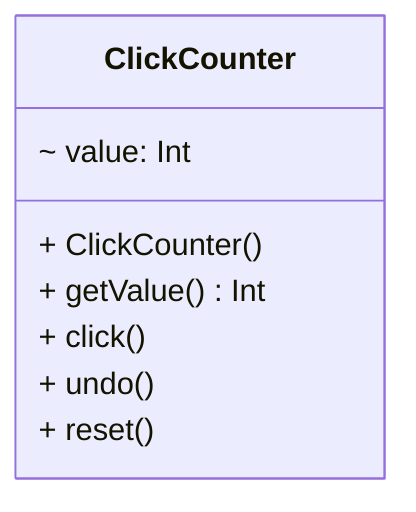

---

**[basic.RationalNumber]** Write a class named RationalNumber representing a rational number.
RationalNumbers are immutable objects, indeed they cannot be changed after creation.
Internally, the class represents numerator and denominator as `Int` values. RationalNumbers must support equality with
other RationalNumbers (see Object.equals(), Object.hashCode())
The class provides the following methods:

* `RationalNumber(numerator: Int, denominator: Int)` creating the rational number. Before creating the object,
  numerator and denominator have to be simplified (i.e., divided by their greatest common divisor).
* `getNumerator(): Int` returning the numerator.
* `getDenominator(): Int` returning the denominator.
* `add(o: RationalNumber): RationalNumber` returning a RationalNumber object representing the sum of the current
  number and another number.
* `multiply(o: RationalNumber): RationalNumber` returning a RationalNumber object representing the multiplication of
  the current number and another number.
* `toString(): String`.

You can use the following two methods for computing the least common multiple and the greatest common divisor of two
integer numbers. These methods are not part of the public interface of the class.

```kotlin
import kotlin.math.absoluteValue
import kotlin.math.max
import kotlin.math.min

fun greatestCommonDivisor(a: Int, b: Int): Int {
	if (a == 0) {
		if (b == 0) {
			throw IllegalArgumentException("cannot pass (0,0) to greatestCommonDivisor")
		}
		return b
	}
	
	if (b == 0) {
        return a
    }
	
	val max = max(a, b)
	val min = min(a, b)
	
	val rest = max % min
	return if (max % min == 0) {
	  min
	} else {
	  greatestCommonDivisor(min, rest)
	}
}

fun leastCommonMultiple(a: Int, b: Int): Int {
	return (a * b).absoluteValue / greatestCommonDivisor(a, b)
}
```

Refer to the UML diagram, JavaDoc documentation, and unit tests for further inspiration.

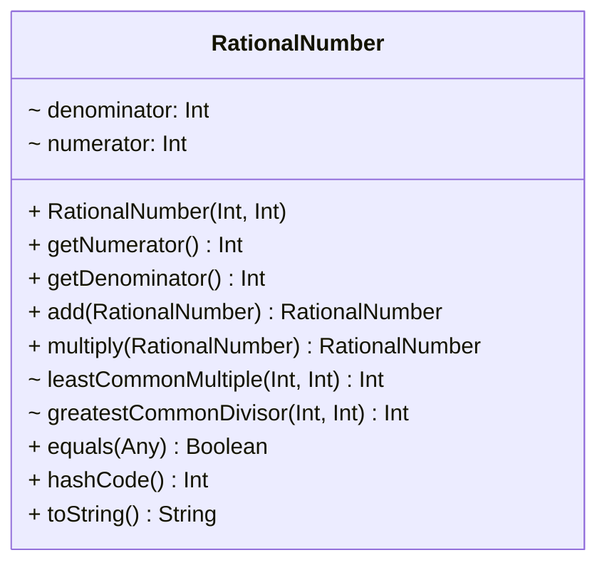

---

**[basic.Circle]** Write a class named Circle representing a Circle on a 2D plane.
Internally, the class uses a `Point` object and an `Int` value for representing the center and the radius of the Circle,
respectively.
The class provides the following methods:

* `Circle(center: Point, radius: Int)` creating the circle.
* getters and setters.
* `getPerimeter(): Double` returning the perimeter of the circle.
* `getArea(): Double` returning the area of the circle.
* `contains(point: Point): Boolean` returning true if point is contained within the circle.
* `translate(dx: Int, dy: Int)` moving the circle on the 2D plane. dx and dy are the x and y components of the
  translation vector.
* `toString(): String`.

Refer to the UML diagram, JavaDoc documentation, and unit tests for further inspiration.

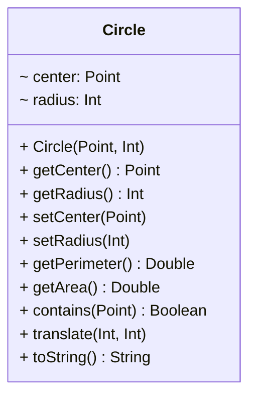

---

**[basic.Polygon]** Write a class named Polygon representing an irregular polygon.
Internally, the class uses a `Array<Point>` for representing the vertices of the polygon.
The class provides the following methods:

* `Polygon(vertices: Array<Point>)` creating the polygon.
* `getVerticesCount(): Int` returning the number of vertices.
* `getPerimeter(): Double` returning the perimeter of the polygon.
* `getArea(): Double` returning the area of the polygon.
* `toString(): String`.

Refer to [this guide](https://arachnoid.com/area_irregular_polygon/index.html) for computing perimeter and area.

Refer to the UML diagram, JavaDoc documentation, and unit tests for further inspiration.

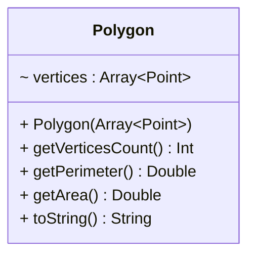

---

**[basic.BankAccount]** Write a class named BankAccount representing a bank account.
Internally, the class uses a double value for representing the balance of the account.
The class provides the following methods:

* `BankAccount()` creating an empty account.
* `BankAccount(balance: Double)` creating an account with the specified balance.
* `getBalance(): Double` getting the current balance.
* `deposit(amount: Double)` depositing the specific amount into the account.
* `withdraw(amount: Double)` withdrawing the specified amount from the account.

Refer to the UML diagram, JavaDoc documentation, and unit tests for further inspiration.

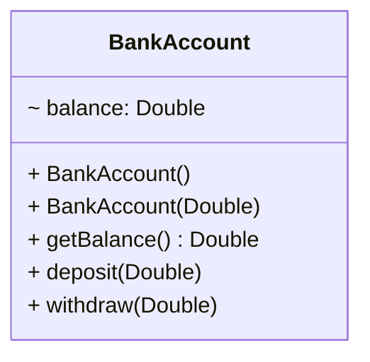

---

**[basic.EnhancedResizableArray]** Write a class named EnhancedResizableArray representing a resizable array. It
internally keeps an `Int` array, enlarges it when needed, and provides its key functionalities via a set of methods:

* `EnhancedResizableArray()` creating an empty resizable array (the underlying `Array<Int>` has a default capacity of 4
  items).
* `get(index: Int)` returning the element at the specified index.
* `set(index: Int, value: Int)` setting the element at the specified index with value. If the underlying `Array<Int>`
  capacity is smaller than index, a new `Array<Int>` (with a capacity of index * 2 items) have to be allocated. All the newly
  allocated elements have to be set to 0.
* `contains(Int value): Boolean` returning true if the specified value is contained within the internal array.
* `fill(Int)` setting all the elements of the internal array to the specified value.
* `length(): Int` returning the capacity of the internal array.
* `toArray(): Array<Int>` returning a copy of the internal array.

Refer to the UML diagram, JavaDoc documentation, and unit tests for further inspiration.

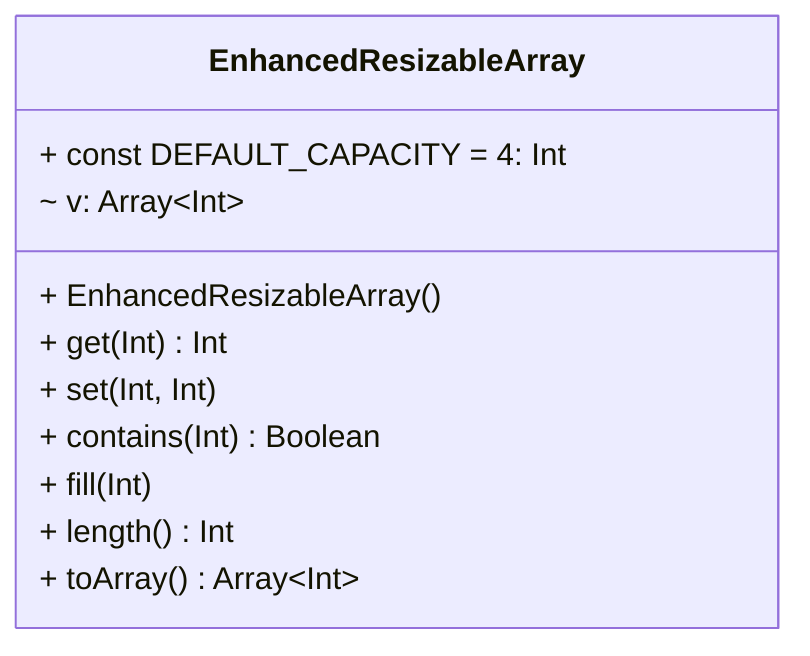

---

**[basic.Letter]** Write a class for authoring a simple letter.
In the constructor, supply the names of the sender and the recipient:

```kotlin
data class Letter(val from: String, val to: String)
```

Supply a method to add a line of text to the body of the letter.

```kotlin
fun addLine(line: String) {
    
}
```

Supply a method that returns the entire text of the letter.

```kotlin
fun getText(): String {
    
}
```

The text has the form:

```
Dear recipient name:
blank line
first line of the body
second line of the body
. . .
last line of the body
blank line
Sincerely,
blank line
sender name
```

Refer to the UML diagram, JavaDoc documentation, and unit tests for further inspiration.

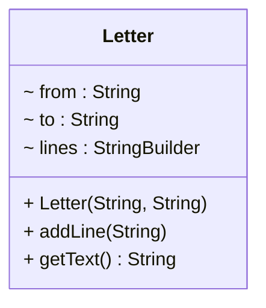

---

**[reverse package]** Given the Reverser interface defining a single method *reverse* for reversing a string, provide
two implementations namely ReverserFast and ReverserSlow providing two different strategies for reversing a `String`. As a
suggestion, ReverserSlow could use a char array (see `String.joinToString()`), while ReverserFast could use a `StringBuilder`.
Provide also a simple main() in which the Reverser interface is implemented anonymously.

Refer to the UML diagram, JavaDoc documentation, and unit tests for further inspiration.

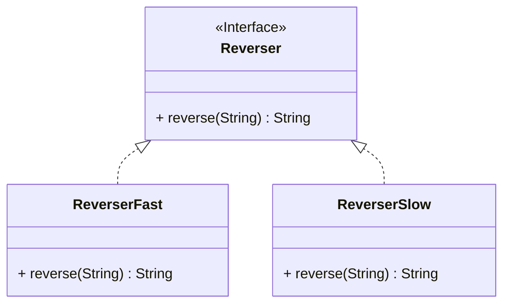

---

**[phonebook package]** Define two classes, namely PhoneBookArray and PhoneBookList implementing the PhoneBook
interface (reported below).

* PhoneBookArray internally models the phone book as a `Array<Person>`.
* PhoneBookList internally models the phone book as a `ArrayList<Person>`.

The methods `searchByLastname`, `searchByNameAndLastname` of the `PhoneBook` interface have to return all the instances
matching the search criteria. Both implementations limit the number of persons to 256 and do not accept duplicate
elements.

Refer to the UML diagram, JavaDoc documentation, and unit tests for further inspiration.

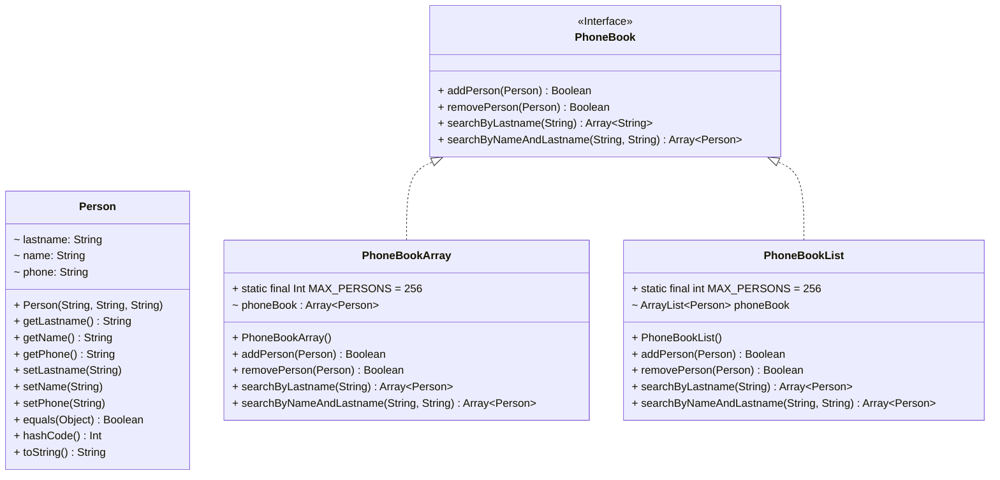

---

**[bankaccount package]** Define two classes, namely BankAccountEasy and BankAccountPro implementing the BankAccount
interface (reported below).

* BankAccountPro represents a fully fledged bank account, allowing international transfers, negative balances, and a 2pc
  interest rate. However, all this comes with the cost of 1 Euro for each operation (deposit, withdrawal). Note well:
  the first two characters of IBANs represent a country code.
* BankAccountEasy represents a basic bank account, which does not support negative balances, international transfers,
  and does not pay any interest. Nevertheless, deposits and withdrawals are free.

Both accounts must refuse to set invalid IBANs or positive fees (money being added for each operation).

Refer to the UML diagram, JavaDoc documentation, and unit tests for further inspiration.

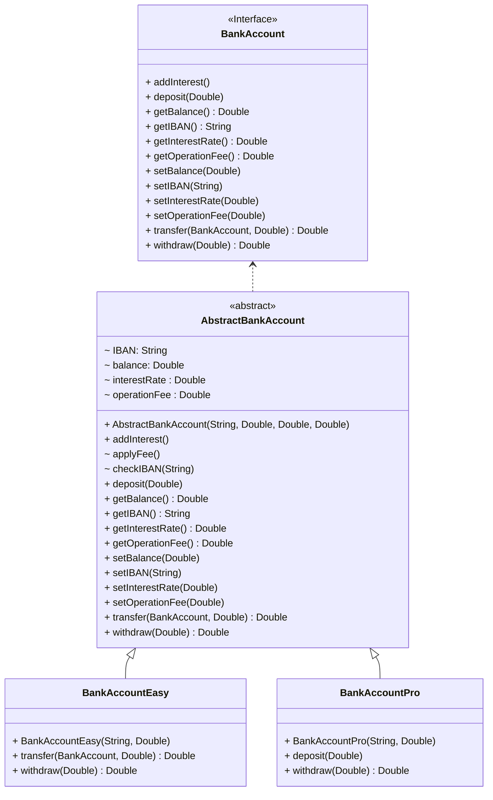

---

**[shape package]** Define two classes, namely Circle and Rectangle representing a circle and rectangle on a 2D plane.

* Circle internally uses a Point object and a double value for representing its center and radius.
* Rectangle internally uses two Point objects for representing its upper-left and bottom-right vertices. The edges of
  the rectangle have to be parallel to the x and y axes.

Both shapes must also support:

* an id (String) for identifying the shape
* a color (String) for coloring the shape (RGB Web Standard #RRGGBB, see https://en.wikipedia.org/wiki/Web_colors)
* the capability of moving on the 2D plane (move() method)
* the capability of resizing (resize() method)
* the capability of computing area and perimeter (getArea(), getPerimeter() methods)

Refer to the UML diagram, JavaDoc documentation, and unit tests for further inspiration.

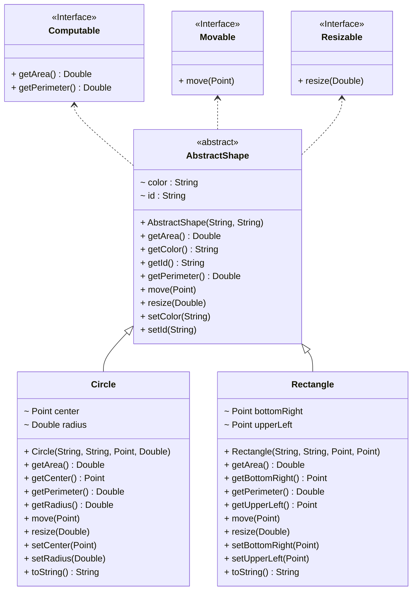

---

**[polynomials package]** Define two classes, namely ArrayPoly and ListPoly providing two implementations of the Poly
interface representing a generic polynomial p = c0 + c1 * x^1 + c2 * x^2 + ... + cn * x^n.

* ArrayPoly internally stores the coefficients (c0 ... cn) as a `Array<Double>`.
* ListPoly internally stores the coefficients (c0 ... cn) as an `ArrayList<Double>`.

As prescribed by the Poly interface, both implementations must provide:

* a method `coefficient(degree: Int)` returning the coefficient of a given degree (0 ... n).
* a method `coefficients()` returning a double[] containing all the coefficients.
* a method `degree()` returning the degree of the polynomial (the number of coefficients - 1).
* a method `derivative()` returning the derivative polynomial.

Both implementations must also redefine `equals()` and `hashCode()` in order to be compared with other Poly objects.

Refer to the UML diagram, JavaDoc documentation, and unit tests for further inspiration.

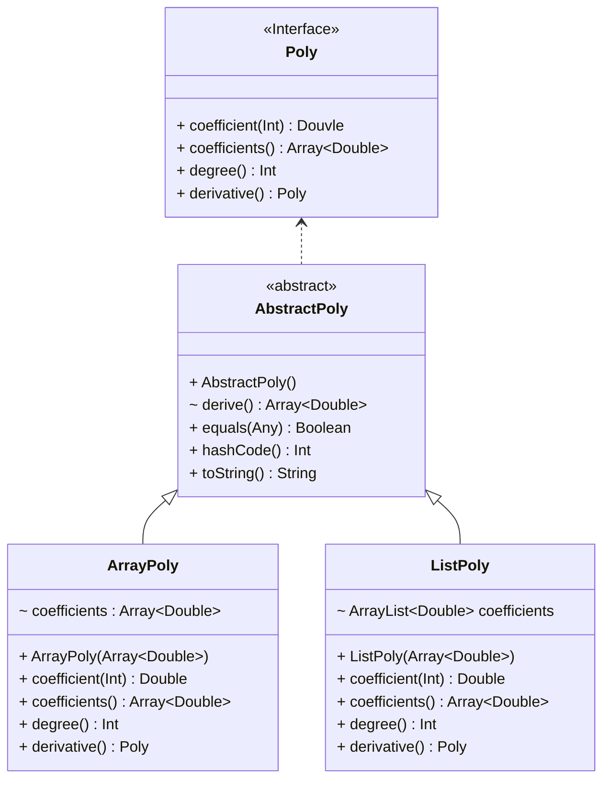

---

**[library package]** A library needs a software system for managing subscribers, rents of books and dvds, and be
notified about late returns.

* Books can be modelled with a title (`String`), a publication year (`Int`), and a number of pages (`Int`).
* Dvds can be modelled with a title (`String`), a publication year (`Int`), and a length in minutes (`Int`).
* People can be modelled with an id (`String`), a name (`String`), and a lastname (`String`).
* Rents can be modelled with an item (a book or a dvd), a person, and two dates representing the beginning and the end
  of the rent.
* The library itself can be modelled as a `List<Rent>` and provides methods for adding/removing rents a method
  `getExpired()` returning all the late rents.

Provide and implementation of all the needed classes.

Refer to the UML diagram, JavaDoc documentation, and unit tests for further inspiration.

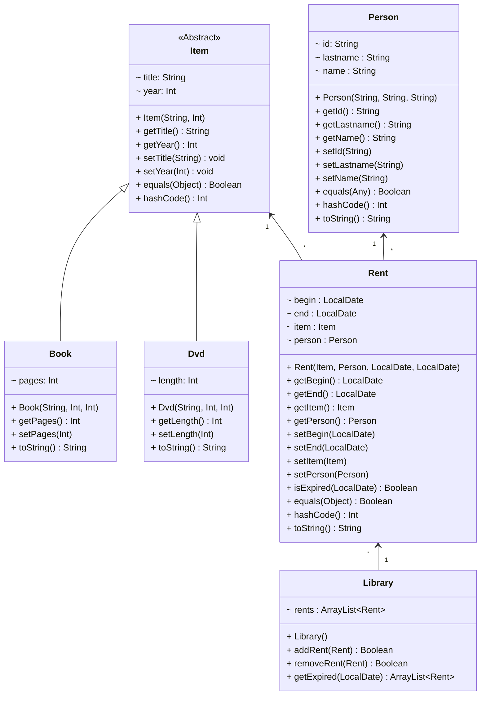

---
